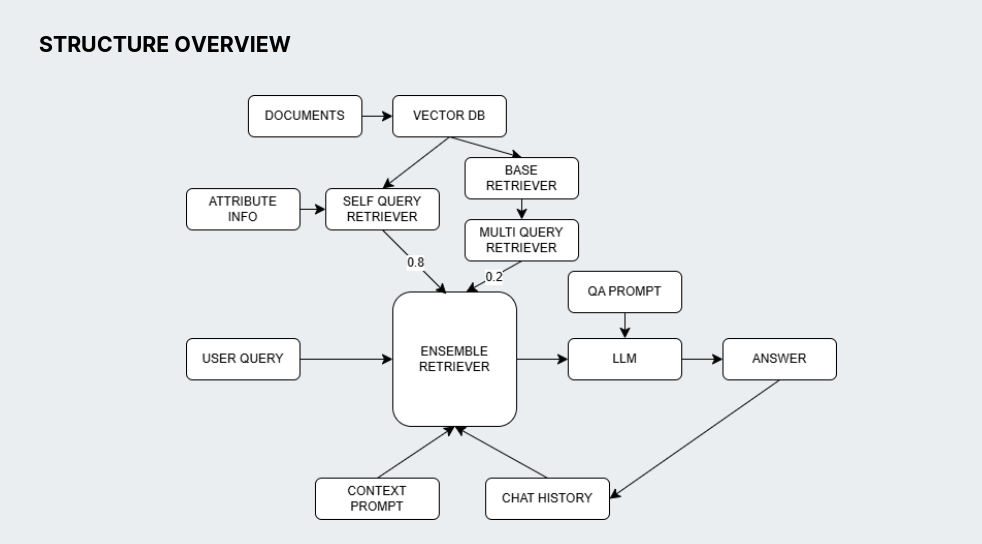

# [RAG를 활용한 MVP 프로젝트] 저작권 지킴이 📚


<br>
<br>


## 🌐 Project Background
<br>
<br>


## 💽 Data 
<br>
<br>


## 🤖 Structure Overview

<br>
<br>


## 🔍 Validation
1️⃣ 한국저작권협의회(링크)에 있는 2023저작권상담사례집에 있는 질문을 발췌  
```
📄발췌한 질문리스트
1. CCTV나 블랙박스 영상도 저작물인가요?
2. 시중에 판매되는 학습교재를 이용하여 동영상 강의를 제작하고 유튜브에 게시해도 되나요?
3. 외국도서를 번역한 경우 저의 번역물이 저작물로 보호될 수 있나요?
```
2️⃣ 1️⃣에서 사용한 질문에 추가질문  
3️⃣ 사례에 대한 질문과 해외 저작권법에 대한 질문을 하여 RAG를 통해 검색이 제대로 이루어졌는지 확인  
<br>
<br>
  

## 📺 Demonstration  
- Validation에서 정한 방법을 바탕으로 3분 이내의 영상 제작  
1️⃣ 웹 애플리케이션에 접속    
2️⃣ 메시지창에 자신이 처한 저작권위반 가능성, 침해받은 가능성 외 저작권 관련 궁금한 사항을 작성  
3️⃣ LLM이 DB에 저장된 문서들을 활용하여
  
      ☑️ 법적근거를 제시하여 답변  
      ☑️ 사례를 요구하는 경우 ⇒ 관련 판례를 제시하여 답변 구성  
      ☑️ 해외(미국,일본)의 저작권법에 해당하는 경우 ⇒ 해외 저작권법을 제시하여 답변 구성  
<br>
<br>


## 📡 Developments
- Tavily 등의 웹 서치 LLM과 연결
  - 웹 서치 llm과 연결하여 데이터베이스 뿐 아니라 다른 국가의 법, 사례 정보를 받아 답변의 품질 향상
- 다른 법률에도 확장 가능하게 만들어 다른 법률에 특화된 챗봇도 구현 가능
- 추가적인 기능 탑재
  - 이미지, 글, 영상 등의 자료 입력 시 저작권 위반 위험이 있는 자료인지 검색하는 기능 추가 가능
  - 저작권 법 및 플랫폼별 정책에 위배되지 않는 저작권 자료를 찾는 기능도 추가 가능
- 질문에 대한 답변을 생성할 때 참고하는 자료가 제한적
  ⇒ Agent를 도입하고 추론 과정을 추가하면 원하는 답변을 더 잘 얻을 수 있을 것으로 예상
<br>
<br>


## 💻 Code References
- 
- 
- 
<br>
<br>


## 🗨️ Tools


